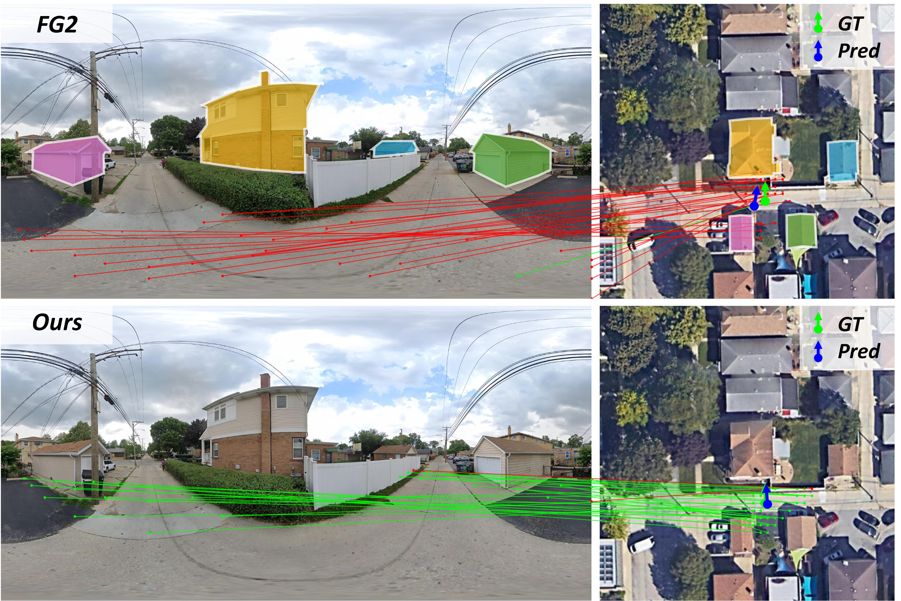

<h1>ViewBridge: Revisiting Cross-View Localization from Image Matching</h1>

Panwang Xia1 *, 
Qiong Wu1 *, 
Lei Yu2, 
Yi Liu1, 
Mingtao Xiong1, 
Xudong Lu3,
Yi Liu1,
Haoyu Guo1,
Yongxiang Yao1,
Junjian Zhang2,
Xiangyuan Cai2,
Hongwei Hu2,
Zhi Zheng3,
Yongjun Zhang1, 
Yi Wan1 †.

1 Wuhan University,  2 Ant Group,  3 The Chinese University of Hong Kong.

* Equally contribution
† Corresponding author

## 🔥 Update

**2025.08.14**
- The paper is post on arXiv!  

## ✅ To-Do
We welcome any questions or suggestions via the Issues section.
- [x] Initial repo structure.
- [ ] Codes and models.
- [ ] CVFM benchmark.

## Abstract:
Cross-view localization aims to estimate the 3-DoF pose of a ground-view image by aligning it with aerial or satellite imagery. Existing methods typically address this task through direct regression or feature alignment in a shared bird’s-eye view (BEV) space. Although effective for coarse alignment, these methods fail to establish fine-grained and geometrically reliable correspondences under large viewpoint variations, thereby limiting both the accuracy and interpretability of localization results. Consequently, we revisit cross-view localization from the perspective of image matching and propose a unified framework that enhances both matching and localization. Specifically, we introduce a Surface Model that constrains BEV feature projection to physically valid regions for geometric consistency, and a SimRefiner that adaptively refines similarity distributions to enhance match reliability. To further support research in this area, we present CVFM, the first benchmark with 32,509 cross-view image pairs annotated with pixel-level correspondences. Extensive experiments demonstrate that our approach achieves geometry-consistent and fine-grained correspondences across extreme viewpoints and further improves the accuracy and stability of cross-view localization. 

The top two rows show localization results, with a shared region highlighted in yellow across views; the red box in the top-left image marks a mismatch from the previous method. 
The bottom two rows show matching results, where green and red lines indicate correct and incorrect matches. 
Our method estimates surface height from the ground view, enabling physically consistent cross-view image matching and more accurate localization.

